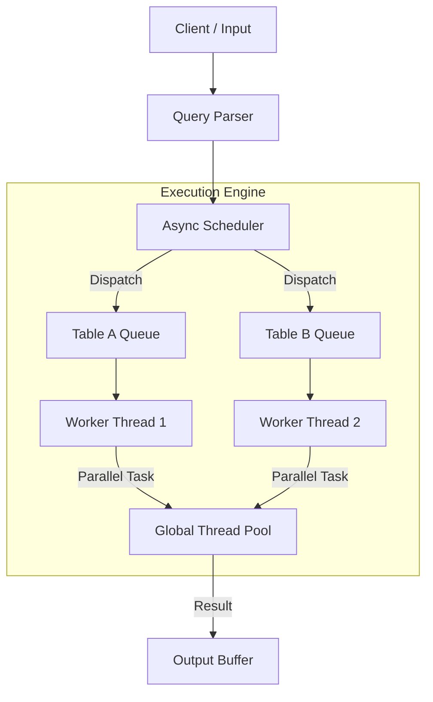

<p align="center">
  <h1 align="center">LemonDB</h1>
</p>

<p align="center">
  <a href="https://focs.ji.sjtu.edu.cn/git/ece482/p2team01/actions/workflows/push.yaml">
    
  </a>
  <a href="#">
    
  </a>
  <a href="#">
    
  </a>
  <a href="#">
    
  </a>
  <a href="#">
    
  </a>
</p>

<p align="center">
  <strong>A high-performance, multi-threaded in-memory database engine built for speed and concurrency.</strong>
</p>

<br/>

**LemonDB** is a modern C++20 database management system designed to maximize throughput on modern multi-core architectures. By leveraging table-level parallelism, asynchronous execution, and intra-query parallelization, it delivers exceptional performance for analytical workloads while maintaining a simple, SQL-like interface.

## Table of Contents

- [Quick Start](#quick-start)
- [Architecture](#architecture)
- [Performance](#performance)
- [Project Structure](#project-structure)
- [Features & Functionality](#features--functionality)
- [Developer Guide](#developer-guide)
- [Roadmap](#roadmap)
- [License](#license)

## Quick Start

Get LemonDB running in under 30 seconds.

### 1. Build
```bash
git clone <repository-url> lemondb && cd lemondb
cmake -S . -B build && cmake --build build -j$(nproc)
```

### 2. Run Interactive Mode
```bash
./build/bin/lemondb
```

### 3. Execute Your First Query
```sql
-- Create a table and insert data
LOAD data/sample.tbl; 
-- Run a parallel aggregation
SELECT ( id salary ) FROM sample WHERE ( id < 100 );
SUM ( salary ) FROM sample;
QUIT;
```

## Architecture

LemonDB adopts a **shared-nothing architecture** for table management combined with a **work-stealing thread pool** for query execution.



### Key Architectural Highlights

| Component | Implementation Details | Performance Benefit |
| :--- | :--- | :--- |
| **Table-Level Parallelism** | Dedicated execution queues per table. | Queries targeting different tables execute simultaneously without lock contention. |
| **Intra-Query Parallelism** | Automatic data chunking for aggregations (`SUM`, `COUNT`, `MAX`). | Massive latency reduction for large datasets by distributing work across cores. |
| **Asynchronous Execution** | Non-blocking parsing and scheduling loop. | Maintains high system responsiveness even during heavy workload spikes. |
| **Custom Thread Pool** | Optimized worker management avoiding OS overhead. | Maximizes CPU utilization and minimizes context switching costs. |

## Performance

*(Benchmark results comparing LemonDB against single-threaded baselines will be added here.)*

### Reproducing Benchmarks

To reproduce the performance benchmarks on your local machine:

```bash
# Generate benchmark data (requires python3)
./scripts/generate-benchmark-data.sh

# Run the benchmark suite
./build/bin/lemondb --threads $(nproc) --listen benchmark/query.sql
```

## Project Structure

```text
lemondb/
|-- src/                # Source code
|   |-- db/             # Database engine core (Table, Database)
|   |-- query/          # Query parsing and execution logic
|   |-- threading/      # Thread pool and concurrency management
|   `-- utils/          # Utility functions and helpers
|-- include/            # Public headers
|-- test/               # Integration and unit tests
|-- scripts/            # Build and utility scripts
|-- hooks/              # Git hooks for code quality
`-- CMakeLists.txt      # Build configuration
```

## Features & Functionality

### Robust Query Support

- **Data Manipulation**: `INSERT`, `UPDATE`, `DELETE`, `SELECT`
- **Table Management**: `LOAD`, `DUMP`, `TRUNCATE`, `COPYTABLE`, `DROP`
- **Aggregations**: `SUM`, `MIN`, `MAX`, `COUNT` (Parallelized)

### Flexible Execution Modes

- **Interactive Mode**: Real-time query execution via standard input (not allowed in production mode).
- **Batch Mode**: Execute complex, multi-step scripts using the `LISTEN` command.

### Advanced Debugging Support

Built-in CMake integration for modern sanitizers ensures code stability and safety:

- **AddressSanitizer (ASan)**: Detects memory corruption and buffer overflows.
- **MemorySanitizer (MSan)**: Identifies uninitialized memory reads.
- **ThreadSanitizer (TSan)**: Detects data races in concurrent execution.
- **UndefinedBehaviorSanitizer (UBSan)**: Catches undefined behavior at runtime.

## Developer Guide

We welcome contributions! Please refer to our **[Developer Guidelines](https://focs.ji.sjtu.edu.cn/git/ece482/p2team01/wiki/Developer-Guidelines)** for comprehensive coding standards and contribution rules.

### Contributing

This project adheres to:
- **[Conventional Commits](https://www.conventionalcommits.org)** for commit messages.
- **[Semantic Versioning](https://semver.org)** for release management.

> [!IMPORTANT]
> **For Contributors:**
> Please install the git hooks to ensure commit message compliance and code quality:
> ```bash
> ./hooks/install-hooks.sh
> ```

### Building with Sanitizers

```bash
# AddressSanitizer (ASan)
cmake -S . -B build -DENABLE_ASAN=ON

# ThreadSanitizer (TSan)
cmake -S . -B build -DENABLE_TSAN=ON
```

### Running Tests & Static Analysis

```bash
./test/run.sh                   # Run test suite
./scripts/run-static-analysis.sh # Run clang-tidy & cppcheck
```

## Roadmap

- [x] Core Database Engine (Tables, Pages, Rows)
- [x] SQL-like Query Parser
- [x] Multi-threaded Execution Engine
- [x] Parallel Aggregation Functions

## License

This project is licensed under the MIT License - see the [LICENSE](LICENSE) file for details.
